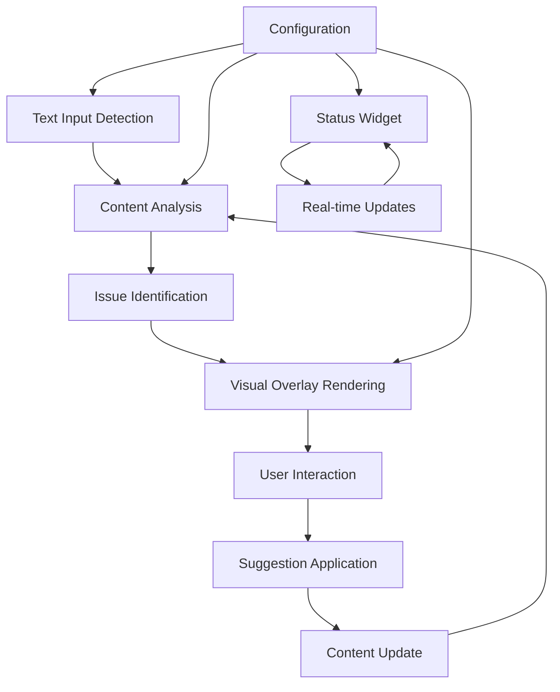

# Design Document

## Overview

The inline grammar checker feature transforms Feelly from a context-menu-based tool into a real-time writing assistant similar to Grammarly. The system continuously monitors text input fields, analyzes content using LLM providers, and provides visual feedback through underlines and hover tooltips. A floating status widget keeps users informed of the extension's activity and error counts.

## Architecture

### Core Components

1. **Text Monitor System** - Detects and tracks text input fields
2. **Analysis Engine** - Processes text content using existing LLM providers
3. **Visual Overlay System** - Renders underlines and tooltips
4. **Floating Status Widget** - Shows real-time status and error counts
5. **Configuration Manager** - Handles user preferences and settings

### Component Interaction Flow



## Components and Interfaces

### 1. Text Monitor System

**Purpose**: Detect and monitor text input fields across web pages

**Key Classes**:
- `TextFieldDetector` - Identifies supported input elements
- `TextFieldWatcher` - Monitors active field for changes
- `EditorAdapter` - Handles different editor types (textarea, contenteditable, rich editors)

**Interface**:
```javascript
class TextFieldDetector {
  detectSupportedFields(): HTMLElement[]
  isFieldSupported(element: HTMLElement): boolean
  getFieldType(element: HTMLElement): 'textarea' | 'contenteditable' | 'input' | 'rich-editor'
}

class TextFieldWatcher {
  watchField(element: HTMLElement): void
  unwatchField(element: HTMLElement): void
  onTextChange(callback: (text: string, element: HTMLElement) => void): void
}
```

### 2. Analysis Engine

**Purpose**: Process text content and identify grammar/writing issues

**Key Classes**:
- `TextAnalyzer` - Coordinates analysis requests
- `IssueDetector` - Identifies specific types of issues
- `AnalysisCache` - Caches results to avoid redundant API calls

**Interface**:
```javascript
class TextAnalyzer {
  analyzeText(text: string, options: AnalysisOptions): Promise<AnalysisResult>
  analyzeTextChunk(chunk: string, context: string): Promise<IssueList>
}

interface AnalysisResult {
  issues: Issue[]
  suggestions: Suggestion[]
  metadata: AnalysisMetadata
}

interface Issue {
  id: string
  type: 'grammar' | 'spelling' | 'style' | 'clarity'
  startIndex: number
  endIndex: number
  message: string
  severity: 'error' | 'warning' | 'suggestion'
  suggestions: string[]
}
```

### 3. Visual Overlay System

**Purpose**: Render visual indicators and interactive tooltips

**Key Classes**:
- `UnderlineRenderer` - Creates and manages underline elements
- `TooltipManager` - Handles hover tooltips and suggestion UI
- `OverlayPositioner` - Calculates positioning for overlays

**Interface**:
```javascript
class UnderlineRenderer {
  renderUnderlines(issues: Issue[], targetElement: HTMLElement): void
  clearUnderlines(targetElement: HTMLElement): void
  updateUnderlinePositions(targetElement: HTMLElement): void
}

class TooltipManager {
  showTooltip(issue: Issue, position: Position): void
  hideTooltip(): void
  onSuggestionClick(callback: (suggestion: string, issue: Issue) => void): void
}
```

### 4. Floating Status Widget

**Purpose**: Display extension status and error counts

**Key Classes**:
- `StatusWidget` - Main widget component
- `StatusUpdater` - Updates widget state based on analysis results

**Interface**:
```javascript
class StatusWidget {
  show(): void
  hide(): void
  updateStatus(status: StatusInfo): void
  setPosition(position: 'top-right' | 'bottom-right' | 'top-left' | 'bottom-left'): void
}

interface StatusInfo {
  isActive: boolean
  isAnalyzing: boolean
  errorCount: number
  warningCount: number
  suggestionCount: number
  breakdown: IssueBreakdown
}
```

## Data Models

### Issue Model
```javascript
interface Issue {
  id: string
  type: IssueType
  startIndex: number
  endIndex: number
  originalText: string
  message: string
  severity: IssueSeverity
  suggestions: Suggestion[]
  ignored: boolean
  appliedSuggestion?: string
}

type IssueType = 'grammar' | 'spelling' | 'style' | 'clarity' | 'tone'
type IssueSeverity = 'error' | 'warning' | 'suggestion'
```

### Suggestion Model
```javascript
interface Suggestion {
  id: string
  text: string
  description: string
  confidence: number
  type: 'replacement' | 'insertion' | 'deletion'
}
```

### Analysis Context
```javascript
interface AnalysisContext {
  fieldType: string
  domain: string
  language: string
  writingStyle: 'formal' | 'casual' | 'technical' | 'creative'
  previousAnalysis?: AnalysisResult
}
```

## Error Handling

### Analysis Errors
- **API Rate Limits**: Queue requests and show appropriate status
- **Network Failures**: Retry with exponential backoff, show offline status
- **Invalid Responses**: Log errors, continue with cached results
- **Provider Errors**: Fallback to alternative providers if configured

### DOM Manipulation Errors
- **Element Removal**: Clean up event listeners and overlays
- **Style Conflicts**: Use CSS specificity and !important declarations
- **Performance Issues**: Debounce analysis, limit concurrent operations

### User Experience Errors
- **Tooltip Positioning**: Fallback positioning when viewport constraints exist
- **Text Selection Conflicts**: Temporarily disable during user selection
- **Scroll Synchronization**: Update overlay positions on scroll events

## Testing Strategy

### Unit Tests
- Text detection and monitoring logic
- Analysis result processing
- Overlay positioning calculations
- Configuration management

### Integration Tests
- End-to-end text analysis workflow
- Cross-browser compatibility (Chrome, Firefox)
- Different text editor types (textarea, contenteditable, rich editors)
- LLM provider integration

### Performance Tests
- Memory usage with large documents
- Analysis response times
- DOM manipulation performance
- Concurrent field monitoring

### User Experience Tests
- Visual regression testing for overlays
- Tooltip interaction flows
- Status widget behavior
- Configuration changes

## Security Considerations

### Content Security Policy
- Ensure inline styles comply with CSP restrictions
- Use nonce-based or hash-based CSP for dynamic content
- Avoid eval() and inline event handlers

### Data Privacy
- Minimize text sent to LLM providers (chunk analysis)
- Implement local caching to reduce API calls
- Respect user privacy settings for data transmission
- Clear sensitive data from memory after analysis

### DOM Security
- Sanitize any user-generated content in tooltips
- Prevent XSS through proper element creation
- Validate DOM manipulation targets
- Use shadow DOM where appropriate for isolation

## Performance Optimization

### Analysis Optimization
- **Debouncing**: 500ms delay after last keystroke
- **Chunking**: Split large texts into manageable pieces
- **Caching**: Store analysis results with text hashes
- **Incremental Analysis**: Only analyze changed portions

### DOM Optimization
- **Virtual Scrolling**: For large documents with many issues
- **Lazy Rendering**: Only render visible underlines
- **Event Delegation**: Use single event listeners for multiple elements
- **RAF Scheduling**: Use requestAnimationFrame for smooth animations

### Memory Management
- **Cleanup Timers**: Remove unused analysis results
- **Weak References**: Use WeakMap for element associations
- **Garbage Collection**: Explicitly null references when done
- **Resource Limits**: Cap maximum concurrent analyses

## Visual Design System

### Color Palette
**Primary Color**: RGB(242, 227, 7) - Bright Yellow
**Color Variations**:
- **Primary Light**: RGB(248, 240, 102) - Lighter yellow for hover states
- **Primary Dark**: RGB(194, 182, 6) - Darker yellow for active states
- **Primary Muted**: RGB(242, 227, 7, 0.1) - Transparent yellow for backgrounds

**Supporting Colors**:
- **Error Red**: RGB(220, 38, 38) - For grammar errors
- **Warning Orange**: RGB(245, 158, 11) - For style warnings  
- **Success Green**: RGB(34, 197, 94) - For correct text/completion
- **Info Blue**: RGB(59, 130, 246) - For suggestions
- **Neutral Gray**: RGB(107, 114, 128) - For secondary text
- **Dark Gray**: RGB(55, 65, 81) - For primary text
- **Light Gray**: RGB(243, 244, 246) - For backgrounds

### Visual Components

#### Underline Styles
```css
.feelly-underline-error {
  border-bottom: 2px wavy rgb(220, 38, 38);
  background: linear-gradient(to bottom, transparent 90%, rgba(220, 38, 38, 0.1) 100%);
}

.feelly-underline-warning {
  border-bottom: 2px wavy rgb(245, 158, 11);
  background: linear-gradient(to bottom, transparent 90%, rgba(245, 158, 11, 0.1) 100%);
}

.feelly-underline-suggestion {
  border-bottom: 2px dotted rgb(59, 130, 246);
  background: linear-gradient(to bottom, transparent 90%, rgba(59, 130, 246, 0.1) 100%);
}
```

#### Floating Status Widget
```css
.feelly-status-widget {
  background: linear-gradient(135deg, rgb(242, 227, 7) 0%, rgb(248, 240, 102) 100%);
  border: 2px solid rgb(194, 182, 6);
  border-radius: 12px;
  box-shadow: 0 4px 12px rgba(0, 0, 0, 0.15);
  color: rgb(55, 65, 81);
  font-weight: 600;
}

.feelly-status-widget:hover {
  background: linear-gradient(135deg, rgb(248, 240, 102) 0%, rgb(242, 227, 7) 100%);
  transform: translateY(-2px);
  box-shadow: 0 6px 16px rgba(0, 0, 0, 0.2);
}
```

#### Tooltip Design
```css
.feelly-tooltip {
  background: white;
  border: 2px solid rgb(242, 227, 7);
  border-radius: 8px;
  box-shadow: 0 8px 24px rgba(0, 0, 0, 0.12);
}

.feelly-tooltip-header {
  background: linear-gradient(90deg, rgb(242, 227, 7) 0%, rgb(248, 240, 102) 100%);
  color: rgb(55, 65, 81);
  font-weight: 600;
  padding: 8px 12px;
  border-radius: 6px 6px 0 0;
}

.feelly-suggestion-button {
  background: rgb(242, 227, 7);
  border: 1px solid rgb(194, 182, 6);
  border-radius: 6px;
  color: rgb(55, 65, 81);
  font-weight: 500;
  transition: all 0.2s ease;
}

.feelly-suggestion-button:hover {
  background: rgb(248, 240, 102);
  transform: translateY(-1px);
  box-shadow: 0 2px 8px rgba(242, 227, 7, 0.3);
}
```

### Animation System
- **Fade In**: 200ms ease-out for tooltip appearance
- **Slide Up**: 150ms ease-out for status widget
- **Pulse**: Subtle pulse animation for active analysis
- **Hover Effects**: 200ms transitions for interactive elements

### Typography
- **Primary Font**: System fonts (-apple-system, BlinkMacSystemFont, 'Segoe UI', Roboto)
- **Font Sizes**: 12px (small), 14px (body), 16px (headers), 18px (titles)
- **Font Weights**: 400 (normal), 500 (medium), 600 (semibold), 700 (bold)

## Browser Compatibility

### Chrome Extensions API
- Use Manifest V3 scripting API for content injection
- Leverage chrome.storage.sync for configuration persistence
- Implement proper permission handling for activeTab

### Cross-Browser Support
- Use WebExtension polyfill for Firefox compatibility
- Handle browser-specific CSS differences
- Test with different viewport sizes and zoom levels
- Support high-DPI displays

### Editor Compatibility
- **Standard Elements**: textarea, input[type="text"]
- **Rich Text Editors**: TinyMCE, CKEditor, Quill, Draft.js
- **Framework Components**: React, Vue, Angular text components
- **Shadow DOM**: Detect and inject into shadow roots when possible